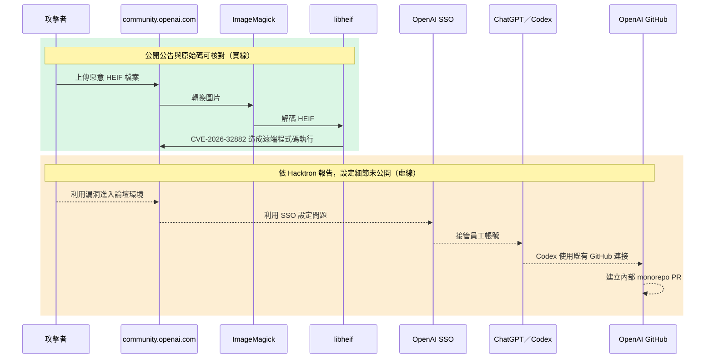

你打開一份 SSO 權限審查表，服務名稱只填了「論壇」。下一欄要列出登入後可觸及的產品和外部資源，ChatGPT、Codex 與 GitHub 接連出現。這個情境的出處，是 Hacktron 在 2026 年 9 月公開的[事件敘述](https://www.hacktron.ai/blog/hacking-openai)。論壇的圖片上傳問題，為什麼會牽連到內部程式庫？

圖片解碼漏洞與 Discourse 的修補，都能用公開資料完整核對。OpenAI SSO 的錯誤設定、員工帳號接管和內部 pull request，則只有研究團隊的說法。把兩類證據分開，才能看懂這次事件真正提醒了什麼。

## 先分清楚兩個漏洞與一條攻擊鏈

這次揭露包含兩個不同問題。第一個是 `libheif` 的 CVE-2026-32882。Discourse 的[安全公告](https://github.com/discourse/discourse/security/advisories/GHSA-vhm9-85gw-x335)確認，惡意 HEIF 檔案可經由圖片上傳造成遠端程式碼執行。公告給出的 CVSS 3.1 分數是 8.8，並列出四條已修補的 Discourse 發行線。

第二個問題發生在 OpenAI SSO。根據 [Hacktron 的事件報告](https://www.hacktron.ai/blog/hacking-openai#intro)，研究團隊先取得 `community.openai.com` 的 Discourse 環境權限，再利用身分驗證設定問題接管多名 OpenAI 員工的 ChatGPT 帳號。團隊表示，其中一個帳號的 Codex 已連上 OpenAI 的 GitHub 組織，於是他們透過 Codex 在內部 monorepo 建立 pull request `#1186742`，隨後停止測試。

攻擊鏈的後半段，沒有公開的 OpenAI SSO 設定、登入交換過程或內部 pull request 可供核對。因此本文只能確認「Hacktron 這樣報告」，不能再往前推論 Slack、電子郵件或其他連接器也已遭存取。這條界線很重要。

把時間線攤開，還能看見兩種證據交錯出現：

| 時間 | 發生的事 | 證據來源與限制 |
| --- | --- | --- |
| 2026-07-23 | Hacktron 表示開始檢查 Discourse 的圖片上傳流程 | [研究團隊的時間線](https://www.hacktron.ai/blog/hacking-openai#heap-buffer-overflow-in-libheif)，屬事件自述 |
| 2026-07-25 05:00 至 06:00 UTC | 團隊表示取得論壇環境的遠端程式碼執行與管理權限 | [研究團隊的時間線](https://www.hacktron.ai/blog/hacking-openai#intro)，未附公開環境紀錄 |
| 2026-07-25 13:30 至 15:30 UTC | 團隊表示接管員工帳號並建立內部 pull request | [研究團隊的時間線](https://www.hacktron.ai/blog/hacking-openai#intro)，內部連結未公開 |
| 2026-07-25 22:49 UTC | 團隊表示 OpenAI 回覆已完成修補 | [研究團隊轉述的回覆](https://www.hacktron.ai/blog/hacking-openai#intro)，修補差異未公開 |
| 2026-07-27 | Discourse 提交圖片處理隔離修補 | [公開提交](https://github.com/discourse/discourse/commit/a07188016987de1613c961277e2e928aaa7c37ec)，可逐行核對 |
| 2026-07-28 | Discourse 發布 GHSA-vhm9-85gw-x335 | [公開安全公告](https://github.com/discourse/discourse/security/advisories/GHSA-vhm9-85gw-x335)，列出版本與重建方式 |

時間排得很密，不代表每一步都有同等證據。漏洞是否存在，可以查公告與修補；攻擊者是否真的走完整條路徑，目前只能依研究團隊自己的紀錄判斷。內部 pull request 沒有公開，外界無從核對它的內容，這一列也就只能停在「團隊表示建立了 PR」，不能再往外推斷存取範圍有多大。

下圖的綠色區塊與實線，是能用公開公告和原始碼核對的部分；橘色區塊與虛線，則是 Hacktron 報告中的事件經過，設定細節並未公開。



圖裡的關鍵，是每跨越一次權限邊界，要處理的安全問題就換了一種：

| 跨越位置 | 當下取得的能力 | 證據狀態 | 審查時要追的項目 |
| --- | --- | --- | --- |
| 上傳檔案到圖片解碼器 | 讓原生程式碼處理攻擊者控制的資料 | Discourse 公告與原始碼可核對 | 格式、解碼器版本、執行程序 |
| 解碼器到論壇環境 | 在 Discourse 圖片上傳路徑造成遠端程式碼執行 | Discourse 公告可核對 | 檔案權限、網路權限、程序隔離 |
| 論壇環境到 OpenAI SSO | 把論壇入侵延伸到 OpenAI 帳號 | 僅有 Hacktron 報告 | SSO 信任設定、工作階段與修補紀錄 |
| 員工帳號到 Codex | 使用該帳號既有的產品能力 | 僅有 Hacktron 報告 | 代理權限與可用連接器 |
| Codex 到 GitHub | 代表帳號在內部程式庫建立 pull request | 僅有 Hacktron 報告 | GitHub 授權範圍、組織政策與稽核紀錄 |

這五列不能合併成一句「論壇有漏洞」。每往下一列，負責修補的人、該查的紀錄和能降低後果的控制都不一樣。

## HEIF 圖片如何進入原生解碼器

HEIF 不是單純存放在伺服器上的附件。Discourse 會把它交給圖片處理程式轉換。在事故後的[防禦性修補](https://github.com/discourse/discourse/commit/a07188016987de1613c961277e2e928aaa7c37ec)中，`lib/upload_creator.rb` 的 `convert_heif!` 呼叫 `execute_convert`，後者再進入 `ImageMagick.magick`，最後由 ImageMagick 呼叫底層的 HEIF 解碼器。

同一份修補新增 `lib/image_magick.rb`，把 ImageMagick 命令交給 `Discourse::SafeExec.capture`。這層 wrapper 只允許指定的讀寫路徑，清除未列出的環境變數，並以 `seccomp_deny_network: true` 關閉網路。這些限制的目的，是在解碼器再次出錯時縮小它能讀、能寫和能連線的範圍。

這份修補同時用了兩種策略，各自回答不同的問題：

| 修補策略 | 直接處理的問題 | 留下的工作 |
| --- | --- | --- |
| 更新 `libheif` | 修正已知的邊界計算錯誤 | 繼續追蹤發行版回補與後續解碼器漏洞 |
| 隔離 ImageMagick | 限制圖片程序可讀、可寫、可連線的範圍 | 確認核心支援、允許清單與實際執行路徑 |

只做第一項，下一個解碼器錯誤仍會在原有權限下執行；只做第二項，已知漏洞仍留在映像裡。修掉已知錯誤，和限制未知錯誤的後果，兩件事都要做。

上游 `libheif` 的[修補提交](https://github.com/strukturag/libheif/commit/85e21ad44eba931314337300a2376b8d28f085ae)改寫 `HeifPixelImage::overlay` 的重疊區域計算，把加法轉成 `int64_t` 之後再比較邊界。提交標題只有「simplify overlay overlap area computation」，沒有標示這是安全修補。這份差異能看出程式碼改了什麼，卻不足以還原完整的利用方式，也看不出下游套件為何會漏掉這次修補。

## SSO 如何把論壇事故帶進 Codex

論壇的遠端程式碼執行只說明了攻擊鏈的第一段。後續影響取決於 OpenAI SSO 如何處理論壇登入，以及成功登入後的帳號能使用哪些產品和連接器。這部分的公開技術資料不足。

Hacktron 表示，他們驗證了一條不需使用者互動的帳號接管路徑，再用遭接管帳號中的 Codex 操作 GitHub。公開資料沒有揭露 SSO 錯誤設定的具體欄位、權杖內容、工作階段交換流程或修補差異，外部也無法用現有材料重現這一段。

能確定的判斷範圍到此為止。現有資料只構成一段事件敘述：Hacktron 表示已向 OpenAI 通報，但核心設定並未公開。它不能當成一份可複製的 OpenAI SSO 漏洞說明。

要檢查這一段，可以把「登入」拆成三層。第一層是身分確認，回答系統把登入的人認成誰。第二層是服務信任，回答一個服務建立的登入狀態能在哪些產品延續。第三層是代理授權，回答 Codex 能代表這個身分操作哪些外部資源。

本案最缺的是第二層的技術資料。公開材料沒有說明論壇端持有什麼憑證、OpenAI SSO 接受了什麼登入狀態，也沒有說明修補動了哪一段判斷邏輯。第三層則只知道 Hacktron 所述的結果：Codex 已連接 GitHub，並被用來建立 pull request。把三層分開，才能避免用一個模糊的「SSO 有問題」蓋過所有待查項目。

{: width="960" height="540" }
_當登入身分能帶到其他服務，審查表的一行很快就不夠用。_

## 只看上游版號會判錯修補狀態

「看到 `libheif 1.19.8` 就判定仍有漏洞」是錯的。Linux 發行版會在不動上游版本號的情況下回補安全修正，所以要判斷修補狀態，得拿完整的套件修訂版去對發行版公告。

Debian 的 [DSA-6417-1](https://lists.debian.org/debian-security-announce/2026/msg00328.html) 列出 CVE-2026-32882，並指出 Debian 13 trixie 已在 `1.19.8-1+deb13u1` 這個版本修掉公告列出的問題。上游的 `1.19.8` 和帶有 `-1+deb13u1` 的套件，修補狀態並不相同。

版本盤點也回答不了隔離的問題。Discourse 公告把新增的 Landlock 與 seccomp 限制稱為縱深防禦，並註明是否生效取決於系統核心支援；套件版本再新，也看不出這層限制在這台主機上有沒有生效。

資產清單若只記 `libheif 1.19.8`，就少了判斷修補狀態所需的資訊。至少要保留上游版本、發行版完整套件修訂版，以及實際部署的映像識別資訊。前兩項回答套件包含哪些回補，最後一項回答修過的套件是否真的進入執行環境。

這也解釋了為何「掃描器顯示某個上游版本」不能直接結案。掃描結果是調查起點，發行版公告與執行中的映像才共同決定當下狀態。

## 隔離圖片處理也有部署條件

Discourse 的[修補提交](https://github.com/discourse/discourse/commit/a07188016987de1613c961277e2e928aaa7c37ec)指出 Landlock 需要 Linux 5.13 以上。核心不支援時，不能把「程式碼已經加上沙箱」直接當成「這台主機已經限制了圖片程序」。部署檢查必須包含核心能力與實際啟用狀態。

安全更新也會帶來相容性取捨。[DSA-6417-1](https://lists.debian.org/debian-security-announce/2026/msg00328.html) 說明，為了修補同一份公告列出的另一個漏洞 CVE-2026-47178，Debian 會拒絕一類圖片：未壓縮、使用 4:2:0 或 4:2:2 色度抽樣，並採用分塊或特定交錯方式。這不是 CVE-2026-32882 的直接代價，也不代表所有 HEIF 都無法解碼，但它說明套件公告裡的行為變更要逐條讀完。

更新解碼器，也要隔離解碼程序。

## 依部署環境決定檢查項目

如果你自行維運 Discourse，安全公告已給出明確修補版本和重建方式。檢查部署映像中的實際套件修訂版，對照發行版的安全公告，再確認目前的核心能提供 Discourse 所需的隔離能力。只更新 Web 介面，無法證明底層映像已換掉。

如果你維護其他接受 HEIF 或 AVIF 上傳的服務，Discourse 的版本號不適用。此時要找出哪個程序解析不受信任的圖片、它使用哪個 `libheif` 套件，以及該程序能讀寫哪些路徑、能否連線。Discourse 的 `SafeExec` 實作可以當成參考案例，但不能直接搬成其他框架的修補。

如果你只使用託管服務，沒辦法自行檢查供應商的映像，能做的就轉向身分與連接器的盤點。逐項列出 SSO 登入後能開啟的產品，以及 Codex 等代理已獲准操作的外部資源。這份清單正是本案公開材料留下的管理問題。

同一條事件鏈會落到不同負責人手上。下表可以直接拿去分派檢查：

| 負責範圍 | 第一個要回答的問題 | 完成時應留下的資料 |
| --- | --- | --- |
| 應用維運 | 哪條上傳路徑會呼叫 HEIF 或 AVIF 解碼器 | 程式入口、實際命令與格式清單 |
| 平台與容器 | 執行中的映像含哪個套件修訂版 | 映像識別資訊、套件版本與公告對照 |
| 主機安全 | 圖片程序實際受到哪些限制 | 核心版本、檔案允許清單與網路政策 |
| 身分管理 | 論壇登入狀態能在哪些服務延續 | SSO 服務清單、信任設定與工作階段規則 |
| AI 工具管理 | 每個代理連接器能操作哪些外部資源 | 連接器清單、授權範圍、擁有者與撤銷方式 |

任何一列只能回答「系統有擋」，就表示檢查還沒完成。這份表要留下能重複核對的設定、版本或紀錄。

## 從部署映像與套件公告開始核對

自架 Discourse 可以依下列順序處理：

1. 在 Discourse 安全公告中找到正在使用的發行線與已修補版本。
2. 檢查部署映像中的完整 `libheif` 套件修訂版，並和該 Linux 發行版的安全公告比對。
3. 依 Discourse 公告重建應用映像。
4. 確認主機核心支援隔離機制，並檢查圖片處理程序的讀寫與網路限制。
5. 盤點 OpenAI SSO 帳號可使用的產品，以及 Codex 已連接的外部資源。

每一步都要有可驗收的結果：完整套件修訂版要對得上發行版公告，執行環境要能證明已換成含修補的映像，圖片程序的檔案與網路限制要能實際觀察，每個連接器也要有擁有者、範圍與撤銷方式。

[Discourse 公告](https://github.com/discourse/discourse/security/advisories/GHSA-vhm9-85gw-x335)提供的重建指令是：

```bash
./launcher rebuild app
```
{: .nolineno }

這條指令引自公告，本文並未實際執行。真的要跑之前，請依你的部署方式備份，並讀完公告中適用的版本說明。

## 我的判斷是重新畫出 SSO 的信任關係

上文的圖片解碼漏洞、Discourse 修補和 Debian 套件更新都有資料可查；接下來是我的判斷，公開證據還不足以完整支持。我認為，只要 AI 代理已連上企業資源，團隊就該重新檢查 SSO 服務之間的信任關係。

傳統 SSO 盤點常把問題寫成「誰能登入哪個應用」。加入代理之後，還要把「代理能代表這個身分操作哪些系統」列成檢查項目。Hacktron 描述的 Codex 與 GitHub 路徑，正好支持這個檢查方向。公開證據無法證明 OpenAI 的實際權杖範圍，也無法證明重新劃分單一登入服務一定能阻止該次接管。

這項判斷不需要假定 AI 代理本身有漏洞。只要代理保留了使用者授予的連接器權限，評估身分系統失守的後果時，就必須把這些權限算進去。

這也會改變事件演練的問法。題目若停在「員工帳號失守後能看到什麼」，就得再往下問「這個帳號能命令代理做什麼」。讀取資料、修改程式碼與建立 pull request 是不同權限，不能用一句「已連接 GitHub」帶過。

Hacktron 還表示，HEIF Heist 這項涵蓋多個目標的研究持續兩個月，由三名研究者進行，token 成本低於 3,000 美元。[原文的成本段落](https://www.hacktron.ai/blog/hacking-openai#costs-of-finding-these-vulnerabilities)沒有提供逐次執行紀錄，範圍也大於這次 OpenAI 事件。這個數字不能拿來估算一般攻擊成本，但它可以提醒演練者：穩定利用記憶體漏洞，不必再預設成只有大型團隊才負擔得起的工作。

更實用的變化，是把代理權限納入每次身分審查。新增連接器時記下資源範圍，職務改變時重新確認，事件發生時能一次撤銷。這些做法不依賴 OpenAI SSO 的未公開細節，也能縮小其他帳號接管事件的後果。

## 先查圖片程序能碰到什麼

論壇的圖片上傳問題，為什麼會牽連到內部程式庫？依 Hacktron 的敘述，第一個漏洞取得論壇執行權限，第二個 SSO 問題把論壇身分帶進 ChatGPT 與 Codex，既有的 GitHub 連接再把影響延伸到內部程式庫。前半段有公開修補可以核對，後半段則缺少可重現的設定資料。

最小的一步，是打開目前的權限審查表。找到一個可用 SSO 登入且支援代理連接器的服務，補上「登入後可操作的外部資源」這一欄。技術面則從圖片處理程序的套件修訂版與檔案、網路權限開始查。

## 延伸閱讀

- [Hacktron 的完整事件報告](https://www.hacktron.ai/blog/hacking-openai)：查看研究團隊如何描述時間線、SSO 接管與 Codex 建立內部 pull request；這些部分仍屬團隊自述。
- [Discourse 安全公告 GHSA-vhm9-85gw-x335](https://github.com/discourse/discourse/security/advisories/GHSA-vhm9-85gw-x335)：核對受影響版本、已修補版本、CVSS 與官方重建指令。
- [Discourse 的圖片處理隔離修補](https://github.com/discourse/discourse/commit/a07188016987de1613c961277e2e928aaa7c37ec)：查看 `ImageMagick` wrapper、允許的讀寫路徑與網路限制如何落進程式碼。
- [Debian 安全公告 DSA-6417-1](https://lists.debian.org/debian-security-announce/2026/msg00328.html)：核對完整套件修訂版，以及其中一項修補造成的格式相容性改變。
- [libheif 的 overlay 計算修補](https://github.com/strukturag/libheif/commit/85e21ad44eba931314337300a2376b8d28f085ae)：直接比較 `HeifPixelImage::overlay` 的邊界計算差異。
