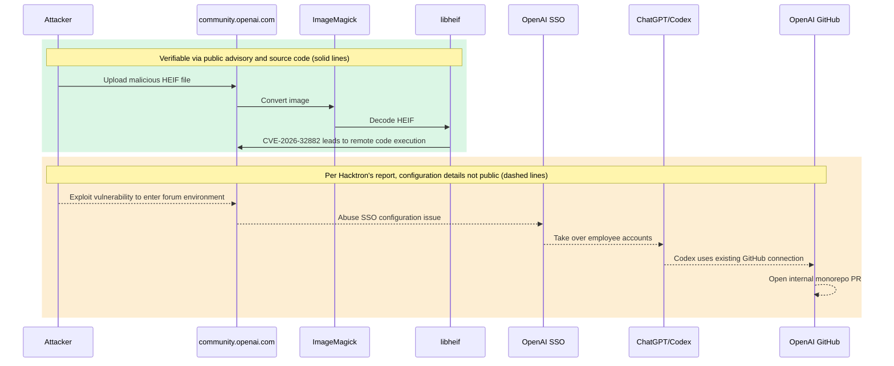

> On July 25, our team hacked OpenAI. It took us less than 72 hours.
>
> Hacktron AI, [original post](https://x.com/HacktronAI/status/2100795824812777893)

You open an SSO access review sheet, and the service name field just says "forum." The next column asks for the products and external resources reachable after login, and ChatGPT, Codex, and GitHub show up one after another. This scenario comes from the [incident write-up](https://www.hacktron.ai/blog/hacking-openai) Hacktron published in September 2026. How does an image upload bug on a forum end up touching an internal code repository?

The image-decoding vulnerability and Discourse's fix can both be fully verified from public sources. The OpenAI SSO misconfiguration, the employee account takeover, and the internal pull request, on the other hand, rest only on the research team's word. You have to keep those two kinds of evidence apart to see what this incident is really warning us about.

## First, Separate the Two Vulnerabilities from the Attack Chain

This disclosure covers two different problems. The first is CVE-2026-32882 in `libheif`. Discourse's [security advisory](https://github.com/discourse/discourse/security/advisories/GHSA-vhm9-85gw-x335) confirms that a malicious HEIF file uploaded as an image can lead to remote code execution. The advisory gives it a CVSS 3.1 score of 8.8 and lists four patched Discourse release lines.

The second problem is in OpenAI SSO. According to [Hacktron's incident report](https://www.hacktron.ai/blog/hacking-openai#intro), the team first gained access to the Discourse environment behind `community.openai.com`, then used an authentication configuration issue to take over the ChatGPT accounts of several OpenAI employees. The team says Codex on one of those accounts was already connected to OpenAI's GitHub organization, so they used Codex to open pull request `#1186742` in an internal monorepo, and then stopped testing.

For the second half of the chain, there is no public OpenAI SSO configuration, login exchange, or internal pull request to check against. So this post can only confirm that "Hacktron reports this." It cannot go further and conclude that Slack, email, or other connectors were also accessed. That line matters.

Laying out the timeline shows the two kinds of evidence interleaved:

| Time | What happened | Evidence source and limits |
| --- | --- | --- |
| 2026-07-23 | Hacktron says it began examining Discourse's image upload flow | [Research team's timeline](https://www.hacktron.ai/blog/hacking-openai#heap-buffer-overflow-in-libheif); self-reported |
| 2026-07-25 05:00 to 06:00 UTC | The team says it gained remote code execution and admin access in the forum environment | [Research team's timeline](https://www.hacktron.ai/blog/hacking-openai#intro); no public environment logs attached |
| 2026-07-25 13:30 to 15:30 UTC | The team says it took over employee accounts and opened an internal pull request | [Research team's timeline](https://www.hacktron.ai/blog/hacking-openai#intro); internal link not public |
| 2026-07-25 22:49 UTC | The team says OpenAI replied that the fix was complete | [OpenAI's reply as relayed by the team](https://www.hacktron.ai/blog/hacking-openai#intro); fix diff not public |
| 2026-07-27 | Discourse commits an isolation fix for image processing | [Public commit](https://github.com/discourse/discourse/commit/a07188016987de1613c961277e2e928aaa7c37ec); verifiable line by line |
| 2026-07-28 | Discourse publishes GHSA-vhm9-85gw-x335 | [Public security advisory](https://github.com/discourse/discourse/security/advisories/GHSA-vhm9-85gw-x335); lists versions and rebuild steps |

A tight timeline does not mean every step has the same quality of evidence. Whether the vulnerability exists can be checked against the advisory and the fix. Whether the attackers actually walked the whole path can, for now, only be judged from the research team's own records. The internal pull request is not public, so outsiders cannot check its contents; that row has to stop at "the team says it opened a PR," and we cannot infer from it how wide the access went.

In the diagram below, the green block and solid lines mark the parts you can verify against the public advisory and source code. The orange block and dashed lines mark the sequence of events as described in Hacktron's report, for which no configuration details have been disclosed.



The key point in the diagram is that every time the chain crosses a privilege boundary, the security problem you have to deal with changes:

| Boundary crossed | Capability gained at that point | Evidence status | What to follow up on in a review |
| --- | --- | --- | --- |
| Uploaded file to image decoder | Native code processes attacker-controlled data | Verifiable via Discourse advisory and source | Formats, decoder version, executing process |
| Decoder to forum environment | Remote code execution on Discourse's image upload path | Verifiable via Discourse advisory | File permissions, network permissions, process isolation |
| Forum environment to OpenAI SSO | Forum compromise extended to OpenAI accounts | Hacktron report only | SSO trust settings, sessions, and fix records |
| Employee account to Codex | Use of the account's existing product capabilities | Hacktron report only | Agent permissions and available connectors |
| Codex to GitHub | Opening a pull request in an internal repo on the account's behalf | Hacktron report only | GitHub authorization scope, org policy, and audit logs |

These five rows cannot be collapsed into a single sentence like "the forum had a bug." Each row has different people responsible for the fix, different records to check, and different controls that can reduce the impact.

## How a HEIF Image Reaches a Native Decoder

A HEIF file is not just an attachment sitting on the server. Discourse hands it to an image-processing program for conversion. In the post-incident [defensive fix](https://github.com/discourse/discourse/commit/a07188016987de1613c961277e2e928aaa7c37ec), `convert_heif!` in `lib/upload_creator.rb` calls `execute_convert`, which calls into `ImageMagick.magick`, and ImageMagick in turn calls the underlying HEIF decoder.

The same fix adds `lib/image_magick.rb`, which routes ImageMagick commands through `Discourse::SafeExec.capture`. This wrapper allows only specified read and write paths, clears any environment variables not on the list, and turns off networking with `seccomp_deny_network: true`. The goal of these restrictions is to limit what the decoder can read, write, and connect to the next time something goes wrong in it.

The fix uses two strategies at once, and each answers a different question:

| Fix strategy | Problem it directly addresses | Work it leaves behind |
| --- | --- | --- |
| Update `libheif` | Fixes the known boundary calculation bug | Keep tracking distro backports and future decoder bugs |
| Isolate ImageMagick | Limits what the image process can read, write, and connect to | Confirm kernel support, allowlists, and the actual execution path |

Do only the first, and the next decoder bug still runs with the old privileges. Do only the second, and the known vulnerability stays in the image. Fixing the known bug and limiting the consequences of unknown bugs are two separate jobs, and you need both.

The upstream `libheif` [fix commit](https://github.com/strukturag/libheif/commit/85e21ad44eba931314337300a2376b8d28f085ae) rewrites the overlap area calculation in `HeifPixelImage::overlay`, converting the additions to `int64_t` before comparing bounds. The commit title is just "simplify overlay overlap area computation," with no indication that it is a security fix. The diff shows what the code changed, but it is not enough to reconstruct the full exploit, and it does not explain why downstream packages missed the fix.

## How SSO Carried the Forum Incident into Codex

Remote code execution on the forum only explains the first leg of the attack chain. What happens next depends on how OpenAI SSO handles forum logins, and which products and connectors a successfully logged-in account can use. The public technical material on this part is thin.

Hacktron says it verified an account takeover path that required no user interaction, then used Codex in a compromised account to operate on GitHub. The public material does not disclose the specific fields involved in the SSO misconfiguration, token contents, the session exchange flow, or the fix diff, so outsiders cannot reproduce this leg from what is available.

That is as far as we can say with confidence. What exists is an incident narrative: Hacktron says it reported the issue to OpenAI, but the core configuration has not been made public. It cannot be treated as a reproducible description of an OpenAI SSO vulnerability.

To examine this leg, you can split "login" into three layers. The first is identity verification: who does the system think is logging in? The second is service trust: which products does a login session established on one service carry over to? The third is agent authorization: which external resources can Codex operate on behalf of this identity?

What this case lacks most is technical detail on the second layer. The public material does not say what credentials the forum side held, what login session OpenAI SSO accepted, or which piece of decision logic the fix changed. For the third layer, all we know is the outcome Hacktron describes: Codex was connected to GitHub and was used to open a pull request. Keeping the three layers apart stops a vague "SSO was broken" from covering up every open question.

{: width="960" height="540" }
_When a login identity carries over to other services, one line on the review form quickly stops being enough._

## Looking Only at the Upstream Version Misjudges Patch Status

Seeing `libheif 1.19.8` does not by itself mean a system is still vulnerable. Linux distributions backport security fixes without changing the upstream version number, so to judge patch status you have to compare the full package revision against the distro's advisory.

Debian's [DSA-6417-1](https://lists.debian.org/debian-security-announce/2026/msg00328.html) lists CVE-2026-32882 and states that Debian 13 trixie fixed the issues in the advisory in version `1.19.8-1+deb13u1`. Upstream `1.19.8` and the package carrying `-1+deb13u1` do not have the same patch status.

A version inventory also cannot answer the isolation question. The Discourse advisory calls the new Landlock and seccomp restrictions defense in depth and notes that whether they take effect depends on kernel support. No matter how new the package version is, it will not tell you whether that layer of restriction is actually active on a given host.

If your asset inventory only records `libheif 1.19.8`, it is missing the information needed to judge patch status. At a minimum, keep the upstream version, the full distro package revision, and the identifier of the image actually deployed. The first two tell you which backports the package includes; the last tells you whether the patched package actually made it into the runtime environment.

This is also why "the scanner shows upstream version X" is not enough to close a ticket. The scan result is where the investigation starts; the distro advisory and the running image together determine the current state.

## Isolating Image Processing Has Deployment Prerequisites

Discourse's [fix commit](https://github.com/discourse/discourse/commit/a07188016987de1613c961277e2e928aaa7c37ec) notes that Landlock requires Linux 5.13 or later. If the kernel does not support it, you cannot treat "the code now has a sandbox" as "this host now restricts the image process." Deployment checks must cover both kernel capability and whether the restriction is actually enabled.

Security updates can also bring compatibility trade-offs. [DSA-6417-1](https://lists.debian.org/debian-security-announce/2026/msg00328.html) explains that to fix CVE-2026-47178, another vulnerability listed in the same advisory, Debian will reject a class of images: uncompressed, using 4:2:0 or 4:2:2 chroma subsampling, and using tiling or certain interleaving modes. This is not a direct cost of CVE-2026-32882, and it does not mean all HEIF files will fail to decode, but it shows that you need to read every behavior change in a package advisory.

Update the decoder, and isolate the decoding process too.

## Decide What to Check Based on Your Deployment

If you run Discourse yourself, the security advisory gives clear patched versions and rebuild steps. Check the actual package revision inside your deployed image, compare it against the distro's security advisory, and then confirm that your current kernel provides the isolation features Discourse needs. Updating only through the web interface does not prove the underlying image has been replaced.

If you maintain another service that accepts HEIF or AVIF uploads, Discourse's version numbers do not apply. Instead, find out which process parses untrusted images, which `libheif` package it uses, and which paths that process can read and write and whether it can make network connections. Discourse's `SafeExec` implementation is a useful reference case, but you cannot lift it directly into another framework as a fix.

If you only use a hosted service and cannot inspect the provider's images yourself, your work shifts to inventorying identities and connectors. List every product reachable after an SSO login, and every external resource that agents such as Codex have been authorized to operate on. That list is exactly the management question this case's public material leaves open.

The same chain of events lands on several different owners. You can use the table below to assign checks directly:

| Area of responsibility | First question to answer | Records to leave when done |
| --- | --- | --- |
| Application operations | Which upload paths invoke a HEIF or AVIF decoder | Code entry points, actual commands, and list of formats |
| Platform and containers | Which package revision is in the running image | Image identifier, package version, and advisory comparison |
| Host security | What restrictions actually apply to the image process | Kernel version, file allowlist, and network policy |
| Identity management | Which services a forum login session carries over to | List of SSO services, trust settings, and session rules |
| AI tool management | Which external resources each agent connector can operate on | Connector list, authorization scope, owner, and how to revoke |

If the only answer a row can give is "the system blocks it," the check is not finished. Each row should leave behind configuration, versions, or records that can be re-verified.

## Start by Checking the Deployed Image Against Package Advisories

For self-hosted Discourse, you can work through the following in order:

1. In the Discourse security advisory, find the release line you are on and its patched version.
2. Check the full `libheif` package revision in your deployed image and compare it against that Linux distribution's security advisory.
3. Rebuild the application image following the Discourse advisory.
4. Confirm that the host kernel supports the isolation mechanism, and check the read/write and network restrictions on the image-processing process.
5. Inventory the products available to OpenAI SSO accounts and the external resources Codex is connected to.

Every step needs a result you can sign off on: the full package revision must match the distro advisory, the runtime environment must demonstrably be running the patched image, the image process's file and network restrictions must be observable in practice, and every connector must have an owner, a scope, and a way to revoke it.

The rebuild command given in the [Discourse advisory](https://github.com/discourse/discourse/security/advisories/GHSA-vhm9-85gw-x335) is:

```bash
./launcher rebuild app
```
{: .nolineno }

This command is quoted from the advisory; I did not actually run it for this post. Before you run it for real, back up according to your deployment setup and read the version notes in the advisory that apply to you.

## My Take: Redraw Your SSO Trust Relationships

The image-decoding vulnerability, the Discourse fix, and the Debian package update above are all backed by sources you can check. What follows is my own judgment, which the public evidence does not yet fully support. I think that once an AI agent is connected to company resources, a team should re-examine the trust relationships between its SSO services.

Traditional SSO inventories usually frame the question as "who can log in to which application." Once agents are in the picture, you also need to check "which systems can the agent operate on behalf of this identity." The Codex-to-GitHub path Hacktron describes supports exactly this line of review. The public evidence cannot prove the actual scope of OpenAI's tokens, nor can it prove that re-partitioning single sign-on services would definitely have stopped that particular takeover.

This judgment does not require assuming the AI agent itself has a vulnerability. As long as an agent holds connector permissions the user granted, you have to count those permissions when assessing the consequences of an identity system being compromised.

It also changes how you frame incident exercises. If the question stops at "what can someone see after an employee account is compromised," you need to push further and ask "what can this account command the agent to do." Reading data, modifying code, and opening pull requests are different permissions, and they cannot be glossed over with a single "connected to GitHub."

Hacktron also says that HEIF Heist, the research effort covering multiple targets, ran for two months with three researchers and cost less than US$3,000 in tokens. [The cost section of the original post](https://www.hacktron.ai/blog/hacking-openai#costs-of-finding-these-vulnerabilities) does not provide per-run logs, and its scope is broader than this OpenAI incident. The number cannot be used to estimate the cost of a typical attack, but it can remind people running exercises that they should no longer assume that reliably exploiting a memory corruption bug is work only large teams can afford.

The more practical change is to fold agent permissions into every identity review. Record the resource scope when a connector is added, re-confirm it when someone changes roles, and be able to revoke it all at once when an incident happens. None of this depends on the undisclosed details of OpenAI SSO, and it can also shrink the consequences of other account takeover incidents.

## Start by Checking What the Image Process Can Touch

How does an image upload bug on a forum end up touching an internal code repository? According to Hacktron's account, the first vulnerability gained execution on the forum, a second SSO problem carried the forum identity into ChatGPT and Codex, and an existing GitHub connection then extended the impact to an internal repository. The first half has public fixes you can verify; the second half lacks reproducible configuration data.

The smallest first step is to open your current access review sheet. Find one service that you can log in to via SSO and that supports agent connectors, and add a column for "external resources operable after login." On the technical side, start with the package revision of your image-processing process and its file and network permissions.

## Further Reading

- [Hacktron's full incident report](https://www.hacktron.ai/blog/hacking-openai): see how the research team describes the timeline, the SSO takeover, and Codex opening an internal pull request; these parts remain the team's own account.
- [Discourse security advisory GHSA-vhm9-85gw-x335](https://github.com/discourse/discourse/security/advisories/GHSA-vhm9-85gw-x335): check affected versions, patched versions, CVSS, and the official rebuild command.
- [Discourse's image-processing isolation fix](https://github.com/discourse/discourse/commit/a07188016987de1613c961277e2e928aaa7c37ec): see how the `ImageMagick` wrapper, allowed read/write paths, and network restrictions land in code.
- [Debian security advisory DSA-6417-1](https://lists.debian.org/debian-security-announce/2026/msg00328.html): check the full package revision and the format compatibility change caused by one of its fixes.
- [libheif's overlay calculation fix](https://github.com/strukturag/libheif/commit/85e21ad44eba931314337300a2376b8d28f085ae): compare the boundary calculation changes in `HeifPixelImage::overlay` directly.
