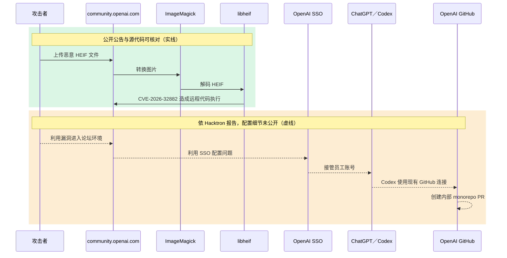

> On July 25, our team hacked OpenAI. It took us less than 72 hours.
>
> Hacktron AI，[原始帖子](https://x.com/HacktronAI/status/2100795824812777893)

你打开一份 SSO 权限审查表，服务名称只填了“论坛”。下一列要列出登录后可触及的产品和外部资源，ChatGPT、Codex 与 GitHub 接连出现。这个场景的出处，是 Hacktron 在 2026 年 9 月公开的[事件描述](https://www.hacktron.ai/blog/hacking-openai)。论坛的图片上传问题，为什么会牵连到内部代码库？

图片解码漏洞与 Discourse 的修复，都能用公开资料完整核对。OpenAI SSO 的错误配置、员工账号接管和内部 pull request，则只有研究团队的说法。把两类证据分开，才能看懂这次事件真正提醒了什么。

## 先分清楚两个漏洞与一条攻击链

这次披露包含两个不同问题。第一个是 `libheif` 的 CVE-2026-32882。Discourse 的[安全公告](https://github.com/discourse/discourse/security/advisories/GHSA-vhm9-85gw-x335)确认，恶意 HEIF 文件可经由图片上传造成远程代码执行。公告给出的 CVSS 3.1 分数是 8.8，并列出四条已修复的 Discourse 发布分支。

第二个问题发生在 OpenAI SSO。根据 [Hacktron 的事件报告](https://www.hacktron.ai/blog/hacking-openai#intro)，研究团队先取得 `community.openai.com` 的 Discourse 环境权限，再利用身份验证配置问题接管多名 OpenAI 员工的 ChatGPT 账号。团队表示，其中一个账号的 Codex 已连上 OpenAI 的 GitHub 组织，于是他们通过 Codex 在内部 monorepo 创建 pull request `#1186742`，随后停止测试。

攻击链的后半段，没有公开的 OpenAI SSO 配置、登录交换过程或内部 pull request 可供核对。因此本文只能确认“Hacktron 这样报告”，不能再往前推论 Slack、电子邮件或其他连接器也已遭访问。这条界线很重要。

把时间线摊开，还能看见两种证据交错出现：

| 时间 | 发生的事 | 证据来源与限制 |
| --- | --- | --- |
| 2026-07-23 | Hacktron 表示开始检查 Discourse 的图片上传流程 | [研究团队的时间线](https://www.hacktron.ai/blog/hacking-openai#heap-buffer-overflow-in-libheif)，属事件自述 |
| 2026-07-25 05:00 至 06:00 UTC | 团队表示取得论坛环境的远程代码执行与管理权限 | [研究团队的时间线](https://www.hacktron.ai/blog/hacking-openai#intro)，未附公开环境日志 |
| 2026-07-25 13:30 至 15:30 UTC | 团队表示接管员工账号并创建内部 pull request | [研究团队的时间线](https://www.hacktron.ai/blog/hacking-openai#intro)，内部链接未公开 |
| 2026-07-25 22:49 UTC | 团队表示 OpenAI 回复已完成修复 | [研究团队转述的回复](https://www.hacktron.ai/blog/hacking-openai#intro)，补丁差异未公开 |
| 2026-07-27 | Discourse 提交图片处理隔离修复 | [公开提交](https://github.com/discourse/discourse/commit/a07188016987de1613c961277e2e928aaa7c37ec)，可逐行核对 |
| 2026-07-28 | Discourse 发布 GHSA-vhm9-85gw-x335 | [公开安全公告](https://github.com/discourse/discourse/security/advisories/GHSA-vhm9-85gw-x335)，列出版本与重建方式 |

时间排得很密，不代表每一步都有同等证据。漏洞是否存在，可以查公告与修复；攻击者是否真的走完整条路径，目前只能依研究团队自己的记录判断。内部 pull request 没有公开，外界无从核对它的内容，这一行也就只能停在“团队表示创建了 PR”，不能再往外推断访问范围有多大。

下图的绿色区域与实线，是能用公开公告和源代码核对的部分；橙色区域与虚线，则是 Hacktron 报告中的事件经过，配置细节并未公开。



图里的关键，是每跨越一次权限边界，要处理的安全问题就换了一种：

| 跨越位置 | 当下取得的能力 | 证据状态 | 审查时要追的项目 |
| --- | --- | --- | --- |
| 上传文件到图片解码器 | 让原生代码处理攻击者控制的数据 | Discourse 公告与源代码可核对 | 格式、解码器版本、运行进程 |
| 解码器到论坛环境 | 在 Discourse 图片上传路径造成远程代码执行 | Discourse 公告可核对 | 文件权限、网络权限、进程隔离 |
| 论坛环境到 OpenAI SSO | 把论坛入侵延伸到 OpenAI 账号 | 仅有 Hacktron 报告 | SSO 信任配置、会话与修复记录 |
| 员工账号到 Codex | 使用该账号现有的产品能力 | 仅有 Hacktron 报告 | 代理权限与可用连接器 |
| Codex 到 GitHub | 代表账号在内部代码库创建 pull request | 仅有 Hacktron 报告 | GitHub 授权范围、组织策略与审核记录 |

这五行不能合并成一句“论坛有漏洞”。每往下一行，负责修复的人、该查的记录和能降低后果的控制都不一样。

## HEIF 图片如何进入原生解码器

HEIF 不是单纯存放在服务器上的附件。Discourse 会把它交给图片处理程序转换。在事故后的[防御性修复](https://github.com/discourse/discourse/commit/a07188016987de1613c961277e2e928aaa7c37ec)中，`lib/upload_creator.rb` 的 `convert_heif!` 调用 `execute_convert`，后者再进入 `ImageMagick.magick`，最后由 ImageMagick 调用底层的 HEIF 解码器。

同一个补丁添加 `lib/image_magick.rb`，把 ImageMagick 命令交给 `Discourse::SafeExec.capture`。这层 wrapper 只允许指定的读写路径，清除未列出的环境变量，并以 `seccomp_deny_network: true` 关闭网络。这些限制的目的，是在解码器再次出错时缩小它能读、能写和能连接的范围。

这个补丁同时用了两种策略，各自回答不同的问题：

| 修复策略 | 直接处理的问题 | 留下的工作 |
| --- | --- | --- |
| 更新 `libheif` | 修复已知的边界计算错误 | 继续跟踪发行版向后移植与后续解码器漏洞 |
| 隔离 ImageMagick | 限制图片进程可读、可写、可连接的范围 | 确认内核支持、允许列表与实际运行路径 |

只做第一项，下一个解码器错误仍会在原有权限下运行；只做第二项，已知漏洞仍留在镜像里。修掉已知错误，和限制未知错误的后果，两件事都要做。

上游 `libheif` 的[修复提交](https://github.com/strukturag/libheif/commit/85e21ad44eba931314337300a2376b8d28f085ae)改写 `HeifPixelImage::overlay` 的重叠区域计算，把加法转成 `int64_t` 之后再比较边界。提交标题只有“simplify overlay overlap area computation”，没有标注这是安全修复。这份差异能看出代码改了什么，却不足以还原完整的利用方式，也看不出下游软件包为何会漏掉这次修复。

## SSO 如何把论坛事故带进 Codex

论坛的远程代码执行只说明了攻击链的第一段。后续影响取决于 OpenAI SSO 如何处理论坛登录，以及成功登录后的账号能使用哪些产品和连接器。这部分的公开技术资料不足。

Hacktron 表示，他们验证了一条不需用户交互的账号接管路径，再用遭接管账号中的 Codex 操作 GitHub。公开资料没有披露 SSO 错误配置的具体字段、令牌内容、会话交换流程或补丁差异，外部也无法用现有材料复现这一段。

能确定的判断范围到此为止。现有资料只构成一段事件描述：Hacktron 表示已向 OpenAI 报告，但核心设置并未公开。它不能当成一份可复现的 OpenAI SSO 漏洞说明。

要检查这一段，可以把“登录”拆成三层。第一层是身份确认，回答系统把登录的人认成谁。第二层是服务信任，回答一个服务建立的登录状态能在哪些产品延续。第三层是代理授权，回答 Codex 能代表这个身份操作哪些外部资源。

本案最缺的是第二层的技术资料。公开材料没有说明论坛端持有什么凭证、OpenAI SSO 接受了什么登录状态，也没有说明修复动了哪一段判断逻辑。第三层则只知道 Hacktron 所述的结果：Codex 已连接 GitHub，并被用来创建 pull request。把三层分开，才能避免用一个模糊的“SSO 有问题”盖过所有待查项目。

{: width="960" height="540" }
_当登录身份能带到其他服务，审查表的一行很快就不够用。_

## 只看上游版本号会判错修复状态

“看到 `libheif 1.19.8` 就判定仍有漏洞”是错的。Linux 发行版会在不动上游版本号的情况下向后移植安全修复，所以要判断修复状态，得拿完整的软件包修订版去对发行版公告。

Debian 的 [DSA-6417-1](https://lists.debian.org/debian-security-announce/2026/msg00328.html) 列出 CVE-2026-32882，并指出 Debian 13 trixie 已在 `1.19.8-1+deb13u1` 这个版本修掉公告列出的问题。上游的 `1.19.8` 和带有 `-1+deb13u1` 的软件包，修复状态并不相同。

版本盘点也回答不了隔离的问题。Discourse 公告把添加的 Landlock 与 seccomp 限制称为纵深防御，并注明是否生效取决于系统内核支持；软件包版本再新，也看不出这层限制在这台主机上有没有生效。

资产清单若只记 `libheif 1.19.8`，就少了判断修复状态所需的信息。至少要保留上游版本、发行版完整软件包修订版，以及实际部署的镜像标识信息。前两项回答软件包包含哪些向后移植，最后一项回答修过的软件包是否真的进入运行环境。

这也解释了为何“扫描工具显示某个上游版本”不能直接结案。扫描结果是调查起点，发行版公告与运行中的镜像才共同决定当下状态。

## 隔离图片处理也有部署条件

Discourse 的[修复提交](https://github.com/discourse/discourse/commit/a07188016987de1613c961277e2e928aaa7c37ec)指出 Landlock 需要 Linux 5.13 以上。内核不支持时，不能把“代码已经加上沙箱”直接当成“这台主机已经限制了图片进程”。部署检查必须包含内核能力与实际启用状态。

安全更新也会带来兼容性取舍。[DSA-6417-1](https://lists.debian.org/debian-security-announce/2026/msg00328.html) 说明，为了修复同一份公告列出的另一个漏洞 CVE-2026-47178，Debian 会拒绝一类图片：未压缩、使用 4:2:0 或 4:2:2 色度采样，并采用分块或特定交错方式。这不是 CVE-2026-32882 的直接代价，也不代表所有 HEIF 都无法解码，但它说明软件包公告里的行为变更要逐条读完。

更新解码器，也要隔离解码进程。

## 依部署环境决定检查项目

如果你自行运维 Discourse，安全公告已给出明确修复版本和重建方式。检查部署镜像中的实际软件包修订版，对照发行版的安全公告，再确认当前的内核能提供 Discourse 所需的隔离能力。只更新 Web 界面，无法证明底层镜像已换掉。

如果你维护其他接受 HEIF 或 AVIF 上传的服务，Discourse 的版本号不适用。此时要找出哪个进程解析不受信任的图片、它使用哪个 `libheif` 软件包，以及该进程能读写哪些路径、能否连接。Discourse 的 `SafeExec` 实现可以当成参考案例，但不能直接搬成其他框架的修复。

如果你只使用托管服务，没办法自行检查供应商的镜像，能做的就转向身份与连接器的盘点。逐项列出 SSO 登录后能打开的产品，以及 Codex 等代理已获准操作的外部资源。这份清单正是本案公开材料留下的管理问题。

同一条事件链会落到不同负责人手上。下表可以直接拿去分派检查：

| 负责范围 | 第一个要回答的问题 | 完成时应留下的数据 |
| --- | --- | --- |
| 应用运维 | 哪条上传路径会调用 HEIF 或 AVIF 解码器 | 程序入口、实际命令与格式清单 |
| 平台与容器 | 运行中的镜像含哪个软件包修订版 | 镜像标识信息、软件包版本与公告对照 |
| 主机安全 | 图片进程实际受到哪些限制 | 内核版本、文件允许列表与网络策略 |
| 身份管理 | 论坛登录状态能在哪些服务延续 | SSO 服务清单、信任配置与会话规则 |
| AI 工具管理 | 每个代理连接器能操作哪些外部资源 | 连接器清单、授权范围、拥有者与撤销方式 |

任何一行只能回答“系统拦住了”，就表示检查还没完成。这份表要留下能重复核对的设置、版本或记录。

## 从部署镜像与软件包公告开始核对

自建 Discourse 可以依下列顺序处理：

1. 在 Discourse 安全公告中找到正在使用的发布分支与已修复版本。
2. 检查部署镜像中的完整 `libheif` 软件包修订版，并和该 Linux 发行版的安全公告比对。
3. 依 Discourse 公告重建应用镜像。
4. 确认主机内核支持隔离机制，并检查图片处理程序的读写与网络限制。
5. 盘点 OpenAI SSO 账号可使用的产品，以及 Codex 已连接的外部资源。

每一步都要有可验收的结果：完整软件包修订版要对得上发行版公告，运行环境要能证明已换成含修复的镜像，图片进程的文件与网络限制要能实际观察，每个连接器也要有拥有者、范围与撤销方式。

[Discourse 公告](https://github.com/discourse/discourse/security/advisories/GHSA-vhm9-85gw-x335)提供的重建命令是：

```bash
./launcher rebuild app
```
{: .nolineno }

这条命令引自公告，本文并未实际运行。真的要跑之前，请依你的部署方式备份，并读完公告中适用的版本说明。

## 我的判断是重新画出 SSO 的信任关系

上文的图片解码漏洞、Discourse 修复和 Debian 软件包更新都有资料可查；接下来是我的判断，公开证据还不足以完整支持。我认为，只要 AI 代理已连上企业资源，团队就该重新检查 SSO 服务之间的信任关系。

传统 SSO 盘点常把问题写成“谁能登录哪个应用”。加入代理之后，还要把“代理能代表这个身份操作哪些系统”列成检查项目。Hacktron 描述的 Codex 与 GitHub 路径，正好支持这个检查方向。公开证据无法证明 OpenAI 的实际令牌范围，也无法证明重新划分单一登录服务一定能阻止该次接管。

这项判断不需要假定 AI 代理本身有漏洞。只要代理保留了用户授予的连接器权限，评估身份系统失守的后果时，就必须把这些权限算进去。

这也会改变事件演练的问法。题目若停在“员工账号失守后能看到什么”，就得再往下问“这个账号能命令代理做什么”。读取数据、修改代码与创建 pull request 是不同权限，不能用一句“已连接 GitHub”带过。

Hacktron 还表示，HEIF Heist 这项覆盖多个目标的研究持续两个月，由三名研究者进行，token 成本低于 3,000 美元。[原文的成本段落](https://www.hacktron.ai/blog/hacking-openai#costs-of-finding-these-vulnerabilities)没有提供逐次运行记录，范围也大于这次 OpenAI 事件。这个数字不能拿来估算一般攻击成本，但它可以提醒演练者：稳定利用内存漏洞，不必再预设成只有大型团队才负担得起的工作。

更实用的变化，是把代理权限纳入每次身份审查。添加连接器时记下资源范围，岗位变动时重新确认，事件发生时能一次撤销。这些做法不依赖 OpenAI SSO 的未公开细节，也能缩小其他账号接管事件的后果。

## 先查图片进程能碰到什么

论坛的图片上传问题，为什么会牵连到内部代码库？依 Hacktron 的描述，第一个漏洞取得论坛执行权限，第二个 SSO 问题把论坛身份带进 ChatGPT 与 Codex，现有的 GitHub 连接再把影响延伸到内部代码库。前半段有公开修复可以核对，后半段则缺少可复现的设置数据。

最小的一步，是打开目前的权限审查表。找到一个可用 SSO 登录且支持代理连接器的服务，补上“登录后可操作的外部资源”这一列。技术面则从图片处理程序的软件包修订版与文件、网络权限开始查。

## 延伸阅读

- [Hacktron 的完整事件报告](https://www.hacktron.ai/blog/hacking-openai)：查看研究团队如何描述时间线、SSO 接管与 Codex 创建内部 pull request；这些部分仍属团队自述。
- [Discourse 安全公告 GHSA-vhm9-85gw-x335](https://github.com/discourse/discourse/security/advisories/GHSA-vhm9-85gw-x335)：核对受影响版本、已修复版本、CVSS 与官方重建命令。
- [Discourse 的图片处理隔离修复](https://github.com/discourse/discourse/commit/a07188016987de1613c961277e2e928aaa7c37ec)：查看 `ImageMagick` wrapper、允许的读写路径与网络限制如何落进代码。
- [Debian 安全公告 DSA-6417-1](https://lists.debian.org/debian-security-announce/2026/msg00328.html)：核对完整软件包修订版，以及其中一项修复造成的格式兼容性改变。
- [libheif 的 overlay 计算修复](https://github.com/strukturag/libheif/commit/85e21ad44eba931314337300a2376b8d28f085ae)：直接比较 `HeifPixelImage::overlay` 的边界计算差异。
